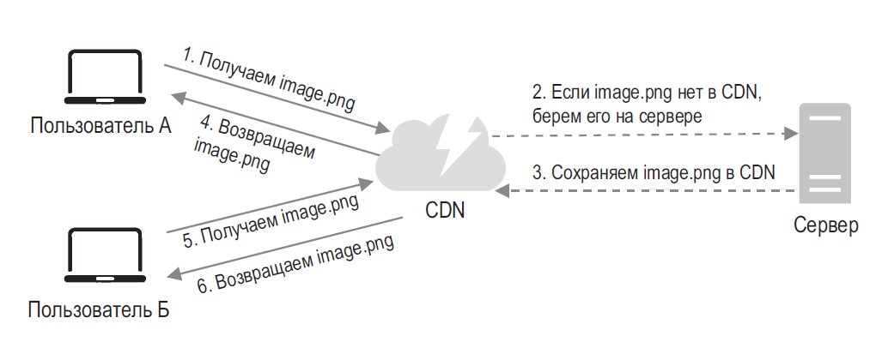

# Architecture

### CDN (Content Delivery Network)
CDN — это сеть географически распределенных серверов, которая используется для доставки **статического** содержимого. Серверы CDN кэшируют такие статические файлы, как изображения, видео, CSS, JavaScript и т. д.
Вот общий принцип работы CDN: когда пользователь посещает веб-сайт, ближайший к нему сервер CDN доставляет **статическое** содержимое.

### Разные ЦОДы

### Масштабирование
#### Сервисы
- Вертикальное - простое, имеет ряд ограничений. 1) имеет лимит. Не получится добавлять ресурсы бесконечно. 2) Не предусматривает отказоустойчивость
- Горизонтальное - добавление новых под, и использование балансировщика нагрузки. Балансировщик нагрузки имеет внешний IP, по которому обращаются к сервисам. Балансировщик же обращается к подам по внутреннему IP

#### БД
Масштабирование БД часто решают через репликацию. Обычно это master/slave. Master только пишет, slave только читает

Преимущества: 
- Повышается производительность. Разделение на чтение/запись улучшает производительность, увеличивая возможность параллельного доступа
- Надежность. Если один сервер будет недоступен - данные не потеряются
- Высокая доступность. Если упадет slave1, ее заменит slave2. Если упадет master, ее немедленно заменит slave

### Микросервисы
#### Плюсы
- Независимое развертывание
- Доступность и отказоустойчивость. Горизонтальное и вертикальное масштабирование при нагрузках
- Жесткие границы модулей 
- Легкое расширение, добавление функциональности

#### Минусы
- Сетевая задержка
- Проблемы с аутентификацией/авторизацией
- Сложнее разработка и девопс
- Сложности с мониторингом
- Зоопарк технологий
- Часто нет прямого доступа к данным, так как у каждого МС своя база
- Трудности с распределенными транзакциями

#### Паттерны
- **Strangler** - паттерн предназначен для постепенного перехода к микросервисной архитектуре от монолитного приложения. Старая функциональность заменяется новыми сервисами, и последние используются после завершения работы, в то время как первые вытесняются.
- **API-Gateway** - обеспечивает единую точку входа для всех сервисов, вместо того чтобы клиент напрямую общался с каждым сервисом. API-шлюз обеспечивает агрегацию, аутентификацию, кэширование и т.д. Все вопросы, связанные с безопасностью, решаются на шлюзе, и только аутентифицированные клиенты получают дальнейший доступ. Такие вопросы, как аутентификация, завершение SSL, ограничение скорости, дросселирование запросов, кэширование и другие, которые должны быть реализованы в каждом сервисе, находятся в ведении шлюза.
- **Saga** - паттерн помогает в управлении транзакциями, где локальные транзакции в каждом сервисе (saga) выполняются, и выдают событие для следующего сервиса, чтобы начать транзакцию. Если какая-либо из транзакций терпит неудачу, серия транзакций, компенсирующих предыдущую транзакцию, будет выполнена saga, чтобы отменить все изменения, сделанные локальными транзакциями, предшествующими этой. Есть 2 способа реализации паттерна 1) **Хореография** - точка управления не централизована, что означает, что каждый сервис будет публиковать сообщение или событие для других сервисов, запуская локальную транзакцию. 2) **Оркестрирование** - На событийной основе операции для saga и транзакций обрабатываются оркестратором saga. Состояние отдельной задачи управляется saga, и в случае сбоя он выполнит транзакцию, чтобы компенсировать предыдущие транзакции.
- **Circuit Breaker** - Этот паттерн предотвращает каскадные сбои в системе. Когда один сервис начинает давать сбои, Circuit Breaker временно блокирует запросы к этому сервису, предотвращая перегрузку и позволяя системе восстановиться. Это повышает устойчивость системы и помогает избежать полного отказа всей системы из-за проблем с одним сервисом.
- **Service Registry** - паттерн решает проблему обнаружения сервисов в распределенной системе. Каждый микросервис регистрирует себя в центральном реестре (например, Netflix Eureka или Consul). Когда одному сервису нужно взаимодействовать с другим, он обращается к реестру, чтобы узнать текущий адрес нужного сервиса. Это позволяет сервисам динамически обнаруживать друг друга без жесткой привязки к конкретным адресам.
- **Bulkhead** - изолирует компоненты системы друг от друга, чтобы сбой в одной части не повлиял на другие. Например, для разных сервисов могут использоваться отдельные пулы потоков или базы данных. Это повышает устойчивость системы и ограничивает распространение сбоев.
- **Event Sourcing (Источник событий)** - Вместо хранения только текущего состояния, этот паттерн сохраняет все события, которые привели к этому состоянию. Это обеспечивает надежный аудиторский след и позволяет восстановить состояние системы на любой момент времени. Особенно полезен в системах, где важна история изменений и возможность отката.
- **Data Sharding** - используется для распределения нагрузки на базу данных. Данные разделяются на несколько баз данных или экземпляров базы данных. Каждый микросервис может обрабатывать подмножество данных или определенные типы запросов. Это помогает избежать узких мест в работе с данными и улучшает масштабируемость.
- **Polyglot Persistence (Многовариантное хранение)** - Этот подход позволяет использовать разные технологии баз данных для разных микросервисов, исходя из их конкретных потребностей. Например, один сервис может использовать реляционную БД, другой – NoSQL, третий – графовую БД. Это оптимизирует хранение, извлечение и обработку данных для каждого сервиса.
- **Retry** - Обеспечивает повторение операции при возникновении временного сбоя – вместо немедленного отказа. Может применяться на разных уровнях: от взаимодействия между сервисами до работы с базой данных. Помогает справиться с кратковременными проблемами в сети или сервисах.
- **Sidecar (Вспомогательный сервис)** - предполагает присоединение вспомогательного сервиса (sidecar) к основному микросервису для обеспечения дополнительной функциональности, такой как логирование, безопасность или коммуникация с внешними сервисами. Позволяет основному сервису сосредоточиться на своей основной функции.
- **Backends for Frontends (BFF)** - BFF предполагает создание отдельных бэкенд-сервисов для каждого типа клиента (веб, мобильный и т. д.). Это позволяет оптимизировать API под конкретные нужды каждого клиента, улучшая производительность и упрощая разработку клиентской части.
- **Shadow Deployment (Теневое развертывание)** - Этот паттерн предполагает отправку копии (тени) производственного трафика к новой версии микросервиса без влияния на реальный пользовательский опыт. Это позволяет проверить производительность и корректность новой версии в реальных условиях, не подвергая риску текущих пользователей.
- **Consumer-Driven Contracts (Контракты, определяемые потребителем)** - В этом подходе потребители сервисов определяют свои ожидания от поставщиков сервисов. Это помогает обеспечить более надежные и согласованные изменения в системе. Каждый сервис-потребитель описывает, какой именно функционал и в каком формате он ожидает от сервиса-поставщика.
- **Smart Endpoints, Dumb Pipes (Умные конечные точки, глупые каналы)** - Этот паттерн рекомендует размещать бизнес-логику в самих микросервисах (умные конечные точки), а не полагаться на сложное промежуточное ПО. Инфраструктура коммуникаций (каналы) должна быть простой и заниматься только маршрутизацией сообщений. Это упрощает систему и делает ее более гибкой.
- **Database per Service (База данных для каждого сервиса)** - В этом паттерне каждый микросервис имеет собственную базу данных, и сервисы общаются через четко определенные API. Это обеспечивает изоляцию данных и независимость сервисов, но требует тщательного подхода к обеспечению согласованности данных между сервисами.
- **Async Messaging (Асинхронный обмен сообщениями)** - Вместо синхронного взаимодействия между микросервисами, этот паттерн предполагает использование очередей сообщений для асинхронной коммуникации. Это может улучшить отзывчивость системы и ее масштабируемость, так как сервисы не блокируются в ожидании ответа друг от друга.
- **Stateless Services (Сервисы без состояния)** - Проектирование микросервисов как stateless (без сохранения состояния) упрощает масштабирование и повышает устойчивость. Каждый сервис обрабатывает запрос независимо, не полагаясь на сохраненное состояние – это облегчает горизонтальное масштабирование.

#### SOLID 
- S - Single Responsibility - означает что класс должен отвечать только за операции одного типа.
- O - Open-Closed - описываемый класс должен быть открыт для расширения, но закрыт для изменений.
- L - Liskov Substitution - если наш класс А является наследником класса В, то любой объект класса В может быть заменен объектом класса А без негативных последствий и нарушения функционала
- I - Interface Segregation - класс должен выполнять только те функции и задачи которые на него возложены, в ином случае это производит к потере ресурсов и появлению багов.
- D - Dependency Inversion - зависимости самого низкого уровня не должны зависеть от зависимостей высшего уровня и наоборот - зависимости высшего уровня НЕ могут существовать без зависимостей низшего уровня.
