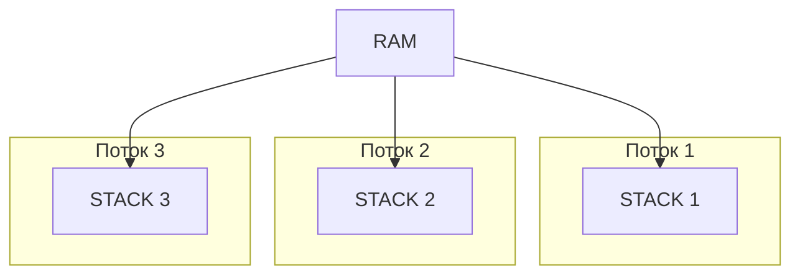

# Многопоточность 
- Процесс - это экземпляр выполненной программы, а также текущие значения счетчика команд, регистров и переменных. С точки зрения операционной системы JVM - процесс. Внутри рабочего процесса есть "рабочие юниты", потоки. Каждый процесс может содержать много потоков.  
- Поток - это основная единица, которой операционная система выделяет время процессора. Каждый поток использует память процессора и его ресурсы.

### Состояния потока
 - New (создан, работа не начата)
 - Active (начал работу)
 - Blocked (опционально)
 - Terminated (работа завершена)

За приоритет потоков отвечает планировщик потоков JVM. Установка приоритетов для ОС носит рекомендательный характер, выполнение не гарантируется 

Потоки демоны имеют низкий приоритет, и прерываются когда программа завершила свою работу. Стандартные потоки завершают работу планово. Используются для back ground процессов или health check, когда не важно чтобы поток завершил свою работу

У каждого потока есть своя Stack память(стек вызовов методов, локальные переменные и аргументы методов)
Все потоки имеют общую Heap память

Как меняется по умолчанию значение объекта для процессора
1) чтение переменной из памяти
2) изменение значения переменной
3) запись нового значения в память

### Синхронизация данных
- Mutex, монитор (Mutual Exclusion Objects) 
- Механизм блокировки
- Любой поток должен "захватить" Мьютекс для доступа к ресурсу, который находится под его "защитой"
- Контролирует доступ только к одному ресурсу
- Каждый объект в java имеет встроенный монитор
- Когда поток захватывает этот монитор, второй поток ожидает
- Монитор связан именно с ОБЪЕКТОМ
- В java существует концепция внешних мониторов. В отличии от внутренних мониторов, которорые могут быть освобождены ЛЮБЫМ потоком, внешний монитор может быть освобожден ТОЛЬКО тем потоком, который его захватил
- Семафоры - переменные, которые используются для контроля доступа к общему ресурсу 
- Существуют бинарные семафоры и семафоры со счетчиком
- Бинарные семафоры впускают только один поток (synchronize)
- Контролируют ТОЛЬКО количество входов

### Способы создания потоков

