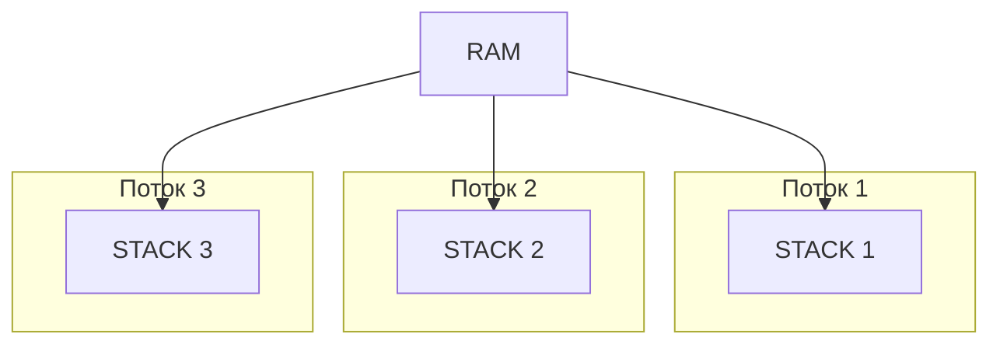

# Многопоточность 
- Процесс - это экземпляр выполненной программы, а также текущие значения счетчика команд, регистров и переменных. С точки зрения операционной системы JVM - процесс. Внутри рабочего процесса есть "рабочие юниты", потоки. Каждый процесс может содержать много потоков.  
- Поток - это основная единица, которой операционная система выделяет время процессора. Каждый поток использует память процессора и его ресурсы.

В чем разница между потоком и процессом?

Процесс является более высокоуровневой абстракцией ОС для выполнения программы, чем поток. Он, в свою очередь, может запускать в себе несколько потоков. Процесс всегда имеет хотя бы один (главный) поток.

### Состояния потока
 - New (создан, работа не начата)
 - Active (начал работу)
 - Waiting (ждет на мониторе) 
 - Blocked (опционально)
 - Terminated (работа завершена)

За приоритет потоков отвечает планировщик потоков JVM. Установка приоритетов для ОС носит рекомендательный характер, выполнение не гарантируется 

Потоки демоны имеют низкий приоритет, и прерываются когда программа завершила свою работу. Стандартные потоки завершают работу планово. Используются для back ground процессов или health check, когда не важно чтобы поток завершил свою работу

У каждого потока есть своя Stack память(стек вызовов методов, локальные переменные и аргументы методов)
Все потоки имеют общую Heap память

Как меняется по умолчанию значение объекта для процессора
1) чтение переменной из памяти
2) изменение значения переменной
3) запись нового значения в память

### Синхронизация данных
- **Mutex**, монитор (Mutual Exclusion Objects) 
- Механизм блокировки
- Любой поток должен "захватить" Мьютекс для доступа к ресурсу, который находится под его "защитой"
- Контролирует доступ только к одному ресурсу
- Каждый объект в java имеет встроенный монитор
- Когда поток захватывает этот монитор, второй поток ожидает
- Монитор связан именно с ОБЪЕКТОМ
- В java существует концепция внешних мониторов. В отличие от внутренних мониторов, которое могут быть освобождены ЛЮБЫМ потоком, внешний монитор может быть освобожден ТОЛЬКО тем потоком, что его захватил (ReentrantLock)
- **Семафоры** - переменные, которые используются для контроля доступа к общему ресурсу 
- Существуют бинарные семафоры и семафоры со счетчиком
- Бинарные семафоры впускают только один поток (synchronize)
- Контролируют ТОЛЬКО количество входов
- **Exchanger** - используется для передачи данных между потоками
- **RaceCondition** - ситуация, когда несколько потоков параллельно получают доступ к общим данным и пытаются их изменить. Итоговое состояние данных зависит от того, в каком порядке потоки получили доступ к данным. Пример - увеличение счетчика i++. Решается с помощью синхронизации доступов к общим данным (блокировки, атомарные операции)
- **DeadLock** - ситуация, когда 2 и более потока бесконечно "ждут" ресурс, который занят другим потоком. Решение проблемы: самое каноничное - взятие блокировок в строгом порядке, уменьшение количества вложенных блокировок, добавлять время действия блокировки (таймаут), алгоритмы без блокировок (???)
- **LiveLock** - система занимается бесполезной работой, ее состояние постоянно меняется, но она зациклена
- **Starvation** - результат процесса, которой не может получить регулярный доступ к общим ресурсам, необходимым для выполнения работы, и, следовательно, не может добиться какого либо прогресса
- Пакет **java.util.concurrent.atomic**.* Под капотом механизм CAS (compare-and-swap). LockFree алгоритм, то есть в работе не используют локи. В этом пакете есть обертки над примитивами, и класс AtomicReference для собственных потоко-безопасных типов данных
- **Race Condition** это условие программы, в которой ее поведение зависит от относительного времени или интерлирования нескольких потоков или процессов

Как узнать что мы поймали DeadLock? Выгрузить ThreadDump. Там будет написан статус потоков, из которого мы сможем сделать вывод о блокировке.

#### CAS (compare-and-swap)
1) Получение текущего значения переменной
2) Вычисление нового значения
3) Сравнение текущего значения и значения из памяти (на случай если оно поменялось)
4) если они равны замена значения из памяти на новое значение, если не равны повторить с первого шага

#### Основные потокобезопасные коллекции
- ArrayList -> **CopyOnWriteArrayList**. Принцип работы - блокировка происходит только на запись/изменение коллекции. Чтение проходит без блокировок.
- HashMap -> **ConcurrentHashMap**. Принцип работы - отдельны монитор на каждый сегмент, а не на всю коллекцию. То есть разбиваем мапу на сегменты, тем самым повышая производительность работы коллекции
- BlockingQueue ???

### Executors
Преимущества:
- Возможность переиспользовать уже созданные потоки
- Меньшие затраты по памяти
- Позволяют планировать и исполнять задачи

Ключевые реализации
- **SingleThreadPoolExecutor** имеет только 1 поток в пуле
- **FixedThreadPoolExecutor** создает фиксированное количество потоков в пуле. Чаще всего это количество процессоров - 1. Задачи накапливаются в LinkedBlockingQueue, и далее воркеры выгребают задачи из него
- **ScheduledThreadPoolExecutor** позволяет выполнять задачи на регулярной основе или с отложенным стартом
- **CachedThreadPoolExecutor** количество потоков в пуле не ограничивается и может быть увеличено при высокой нагрузке. Если нагрузка низкая, количество потоков уменьшается

 ### Fork-Join фреймворк
- Реализация параллельной обработки для ExecutorService, использует принцип "разделяй и властвуй"
- Задачи должны быть независимы друг от друга (сумма элементов в массиве, поиск максимального элемента в массиве)
- Для того чтобы получить возвращаемое значение используем RecursiveTask<T> и переопределяем метод compute()
- Без возвращаемого значения используем RecursiveAction
- Work-Stealing - потоки "воруют" работу друг друга
- Создается фиксированный пул потоков (обычно - количество CPU)

### Способы создания потоков
В Java доступны три варианта создания потока из класса - расширить класс Thread либо реализовать интерфейсы Callable или Runnable. 

