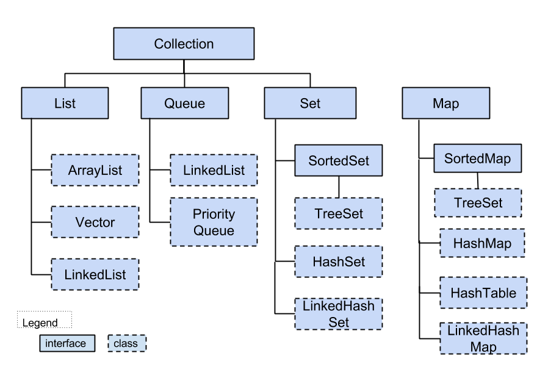
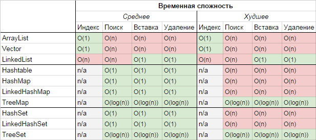

# JAVA

### Области памяти JVM
- Stack
- Heap
- PermGen
- Metaspace
- Eden, New Generation, Old Generation и другие – специфичные для сборщика мусора части кучи, поколения.

### Изменения

#### Java 9
- приватные дефолтные методы в интерфейсах
- внутри try с ресурсами можно объявлять ресурсы не в круглых скобках, а просто передавая названия
- `List<String> list = List.of("s1", "s2", "s3")`. Так же в Set и Map. Коллекции имутабельные.

#### Java 11
- var
- методы String. `isBlank()`, `repeat()`, `lines()`, `strip()`

#### Java 12
- метод String. `transform()` преобразование строк через лямбду
- `collect(Colletors.teeng())` применение нескольких коллекторов в стриме

#### Java 14
- красивый `switch` с использованием `->` вместо `:`

#### Java 15
- красивое объявление длинной строки с помощью строкового литерала `"""`
- красивое `NullPointerException`

#### Java 16
- добавили `record` (неизменяемый класс, финальные поля, переопределенный `equals()` и `hashCode()`)
- при использовании instanceOf не обязательно кастить поле. Вместо этого можно в самом instanceOf объявить переменную `o instanceOf String str`
- `collect(Colletors.toList())` -> `toList()`

#### Java 17 
- `sealed` классы. При объявлении класса разрешает наследоваться только определенным, указанным классам

#### Java 21
- еще более красивый и мощный `switch`. `case String s when s.length() > 4 ...` 

#### Java 22
- unnamed переменные. Вместо придумывания названий переменных которые не используем можно заменять их на `_`. `catch(NumberFormatException _)` 

### Функциональные интерфейсы
- UnaryOperator
- BinaryOperator
- Predicat
- Consumer
- Supplier

### Garbage collectors
- Serial GC - однопоточный, с поколениями.
- Parallel GC - многопоточный вариант Serial
- CMS (Concurrent) - дает меньшую latency (маленькие отдельные паузы), выполняя часть сборки вне Stop The World. Плата за это – меньший throughput. Способ сборки примерно как в предыдущих, работает с поколениями. В Java 9 уже объявлен deprecated;
- G1 GC (Garbage First) – тоже направлен на уменьшение latency. Вместо поколений оперирует регионами; CMS/G1. Если время отклика важнее, чем общая пропускная способность, и паузы при сборке мусора должны быть короче одной секунды.
- Z GC - Если у времени отклика высокий приоритет и/или задействована очень большая куча.
- Shenandoah GC (шенандоу)

Критерии выбора: **потребление ресурсов, пропускная способность, задержки**

### WeakReference и SoftReference
Упоминается в контексте сборки мусора. 

**SoftReference** используется при кешировании внутри системы и будет удален сборщиком мусора в случае если осталось мало памяти, а на объект существуют только ссылки SoftReference. Это критично при кэшировании, так как наш сборщик мусора самостоятельно освободит нам память в критичной ситуации, но до этого момента не будет "трогать" эти объекты.

**WeakReference** - в случае если на объект ссылаются только через weak-ссылки, то объект будет удален сразу при обходе сборщиком мусора. 
