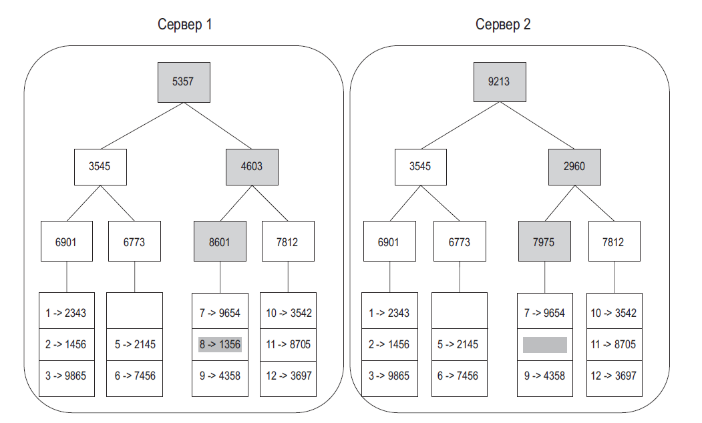

### База
#### Шаг 1: понять задачу и определить масштаб решения
Вот список вопросов, с которых можно начать:
- Какие именно возможности мы будем реализовывать?
- Сколько пользователей у нашего продукта?
- Как скоро ожидается наращивание мощностей? Какой масштаб планируется через 3 месяца, полгода, год?
- Как выглядит технологический стек компании? Какие существующие сервисы можно применить для упрощения архитектуры?

#### Шаг 2: предложить общее решение и получить согласие
Очень желательно в ходе этого процесса наладить совместную работу
- Предложите начальный план архитектуры. Поинтересуйтесь мнением интервьюера. Относитесь к нему как к члену своей команды, с которым вы вместе работаете. Хорошие интервьюеры зачастую любят поговорить и поучаствовать в решении задачи
- Нарисуйте на доске или бумаге блок-схемы с ключевыми компонентами, такими как клиенты (мобильные/браузерные), API-интерфейсы, веб-серверы, хранилища данных, кэши, CDN, очереди сообщений и т. д.
- Выполните приблизительные расчеты, чтобы понять, соответствует ли ваше решение масштабу задачи. Рассуждайте вслух. Прежде чем что-то считать, пообщайтесь с интервьюером
- По возможности пройдитесь по нескольким конкретным сценариям использования. Это поможет вам сформировать общую архитектуру и, скорее всего, обнаружить крайние случаи, о которых вы еще не думали
- Следует ли на этом этапе обозначать конечные точки API-интерфейса и схему базы данных? Это зависит от задачи. Если вас просят спроектировать что-то масштабное, такое как поиск Google, то лучше не углубляться настолько сильно. Если же речь идет о серверной части многопользовательской игры в покер, эти аспекты вполне можно указать. Общайтесь с интервьюером.

#### Шаг 3: глубокое погружение в проектирование
На этом этапе вы и интервьюер достигли следующих целей:
- согласовали общие требования и будущий масштаб
- начертили примерную схему архитектуры
- узнали мнение интервьюера о вашем общем решении
- получили какое-то базовое представление о том, на каких областях нужно сосредоточиться при подробном проектировании (исходя из того, что ответил интервьюер).

#### Шаг 4: подведение итогов
- Интервьюер может попросить вас обозначить узкие места системы и обсудить потенциальные улучшения. Никогда не утверждайте, что ваше решение идеальное. Всегда можно что-то улучшить. Это отличная возможность продемонстрировать свое критическое мышление и оставить о себе хорошее впечатление.
- Возможно, стоит провести краткий обзор вашей архитектуры, особенно если вы предложили несколько решений. Это позволит интервьюеру освежить память, что может пригодиться после длинного собеседования.
- Будет интересно поговорить о внештатных ситуациях, таких как поломка серверов, разрыв сети и т. д.
- Стоит затронуть эксплуатационные вопросы. Как вы отслеживаете метрики и журналы ошибок? Как выкатывается система?
- Проведение следующего этапа масштабирования — тоже весьма интересная тема. Например, если ваша текущая архитектура поддерживает 1 миллион пользователей, какие изменения нужно внести, чтобы увеличить эту цифру до 10 миллионов?
- Если еще остается время, предложите дальнейшие улучшения

#### Время, выделяемое на каждый этап
Примерные расчеты: 
- Шаг 1. Понять задачу и определить масштаб: 3–10 минут.
- Шаг 2. Предложить общее решение и получить одобрение: 10–15 минут.
- Шаг 3. Подробное проектирование: 10–25 минут.
- Шаг 4. Подведение итогов: 3–5 минут.

### Степени двойки
В распределенных системах данные могут достигать огромных размеров, но все вычисления сводятся к элементарным свойствам. Чтобы получить правильный результат, нужно обязательно знать объем данных, используя вторую степень. Байт — это последовательность из 8 бит. Символ ASCII занимает в памяти один байт (8 бит)

| Степень | Примерное значение | Полное название | Сокращенное обозначение |
|---------|--------------------|-----------------|-------------------------|
| 10      | 1 тысяча           | 1 килобайт      | 1 КБ                    |
| 20      | 1 миллион          | 1 мегабайт      | 1 МБ                    |
| 30      | 1 миллиард         | 1 гигабайт      | 1 ГБ                    |
| 40      | 1 триллион         | 1 терабайт      | 1 ТБ                    |
| 50      | 1 квадриллион      | 1 петабайт      | 1 ПБ                    |

### ПОКАЗАТЕЛИ ЛАТЕНТНОСТИ

нс = наносекунда, мкс = микросекунда, мс = миллисекунда

* 1 нс = 10^-9 секунд
* 1 мкс = 10^-6 секунд = 1000 нс
* 1 мс = 10^-3 секунд = 1000 мкс = 1 000 000 нс

| Название операции                                    | Время                   |
|------------------------------------------------------|-------------------------|
| Обращение к кэшу L1                                  | 0,5 нс                  |
| Ошибочное предсказание перехода                      | 5 нс                    |
| Обращение к кэшу L2                                  | 7 нс                    |
| Блокирование/разблокирование мьютекса                | 100 нс                  |
| Обращение к основной памяти                          | 100 нс                  |
| Сжатие 1 Кб с помощью Zippy                          | 10 000 нс = 10 мкс      |
| Отправка 2 Кб по сети 1 Гбит/с                       | 20 000 нс = 20 мкс      |
| Последовательное чтение из памяти 1 Мб               | 250 000 нс = 250 мкс    |
| Перемещение пакета туда и обратно внутри одного ЦОД  | 500 000 нс = 500 мкс    |
| Время поиска по диску                                | 10 000 000 нс = 10 мс   |
| Последовательное чтение 1 Мб из сети                 | 10 000 000 нс = 10 мс   |
| Последовательное чтение 1 Мб с диска                 | 30 000 000 нс = 30 мс   |
| Передача пакета из Калифорнии в Нидерланды и обратно | 150 000 000 нс = 150 мс |

* память быстрая, а диск медленный;
* по возможности следует избегать поиска по диску;
* простые алгоритмы сжатия отличаются высокой скоростью;
* прежде чем отправлять данные по интернету, их по возможности нужно сжимать;
* центры обработки данных обычно находятся в разных регионах, и передача информации между ними занимает время.

### ПОКАЗАТЕЛИ ДОСТУПНОСТИ

Высокая доступность — это способность системы долго и непрерывно находиться в рабочем состоянии. Она измеряется в процентах. 100 % означает,
что сервис никогда не простаивает. У большинства сервисов доступность варьируется от 99 % и 100 %.

| Доступность | Суточный простой    | Недельный простой   | Месячный простой | Годичный простой |
|-------------|---------------------|---------------------|------------------|------------------|
| 99 %        | 14,40 минуты        | 1,68 часа           | 7,31 часа        | 3,65 дня         |
| 99,9 %      | 1,44 минуты         | 10,08 минуты        | 43,83 минуты     | 8,77 часа        |
| 99,99 %     | 8,64 секунды        | 1,01 минуты         | 4,38 минуты      | 52,60 минуты     |
| 99,999 %    | 864,00 миллисекунды | 6,05 секунды        | 26,30 секунды    | 5,26 минуты      |
| 99,9999 %   | 86,40 миллисекунды  | 604,80 миллисекунды | 2,63 секунды     | 31,56 секунды    |

### ПРИМЕР: ОЦЕНКА ТРЕБОВАНИЙ

Предположения:
* 300 миллионов активных пользователей в месяц;
* 50 % из них пользуются Twiter ежедневно;
* пользователи в среднем публикуют по 2 твита в день;
* 100 % твитов содержат медиаданные;
* данные хранятся на протяжении 5 лет.

  Оценки:
* ежедневные активные пользователи (daily active users, DAU) = 300 миллионов * 50 % = 150 миллионов;
* запросов в секунду (queries per second, QPS) = 150 миллионов * 2 твита / 24 часа / 3600 секунд = ~3500;
* пиковый показатель QPS = 2 * QPS = ~7000.

  Здесь мы оценим лишь место, необходимое для хранения данных:
  средний размер твита:
* tweet_id — 64 байта;
* текст — 140 байтов;
* медиаданные — 1 Мб;
* объем данных: 150 миллионов * 2 * 10% * 1 Мб = 30 Тб в день;
* объем данных за 5 лет: 30 Тб * 365 * 5 = ~55 Пб.

## СОГЛАСОВАННОЕ ХЕШИРОВАНИЕ

Для обеспечения горизонтального масштабирования запросы/данные должны распределяться между серверами эффективно и равномерно. Для этого зачастую используется согласованное хеширование

Если у вас есть n кэширующих серверов, балансирование нагрузки обычно обеспечивается с помощью следующего метода хеширования: _serverIndex = hash(key) % N_, где N — размер пула серверов

Такой подход работает хорошо, когда пул серверов имеет фиксированный размер, а данные распределены равномерно. Но при добавлении новых или удалении существующих серверов возникают проблемы. Например, если сервер 1 выйдет из строя, размер пула станет равным 3. Используя имеющуюся функцию хеширования, мы получим то же значение хеша ключа. Но при взятии остатка индексы серверов изменятся, так как их количество уменьшилось на 1

### Две проблемы базового подхода

- учитывая, что серверы могут добавляться и удаляться, их **отрезки на кольце не могут иметь фиксированный размер**. Отрезок — это пространство хеширования между двумя соседними серверами. Размер отрезков, назначаемых каждому серверу, может оказаться как очень маленьким, так и достаточно большим
- распределение ключей на кольце может быть неравномерным

### Виртуальные узлы

Чем больше виртуальных узлов, тем равномернее становится распределение ключей. Это вызвано уменьшением стандартного отклонения, благодаря которому данные распределяются более сбалансированно. Стандартное отклонение определяет, как распределены данные. Результаты эксперимента, проведенного в ходе онлайн-исследования [2], показывают, что стандартное отклонение от среднего составляет 5 % и 10 % для 200 и, соответственно, 100 виртуальных узлов. Чем больше виртуальных узлов, тем меньше отклонение. Но при этом нужно больше места для хранения данных о виртуальных узлах. Мы можем подобрать такое количество, которое лучше всего соответствует требованиям нашей системы.

### Согласованность

Так как данные реплицируются по нескольким узлам, они должны синхронизироваться между репликами. Консенсус кворума может обеспечить согласованность как чтения, так и записи. Для начала перечислим несколько определений.
- **N** = количество реплик.
- **W** = кворум **записи** размера W. Операция записи считается успешной, только если она подтверждена W репликами.
- **R** = кворум **чтения** размера R. Чтобы операцию записи можно было считать успешной, необходимо дождаться ответа как минимум от R реплик.

Как сконфигурировать N, W и R для наших задач? Вот несколько возможных вариантов:
- если **R = 1 и W = N**, система оптимизирована для **быстрого чтения**;
- если **W = 1 и R = N**, система оптимизирована для **быстрой записи**;
- если **W + R > N**, гарантируется **строгая согласованность** (обычно N = 3, W = R = 2);
- если **W + R <= N**, строгая **согласованность не гарантируется**.

### Модели согласованности
Модель согласованности — еще один важный фактор, который следует учитывать при проектировании хранилища типа «ключ–значение». Она определяет степень согласованности данных и имеет широкий спектр разновидностей.
- **Строгая согласованность**. Любая операция чтения возвращает значение, соответствующее результату самой последней операции записи. _Клиент всегда получает актуальные данные_. обычно достигается за счет того, что операции чтения/записи принимаются только после подтверждения текущей записи всеми репликами. Это не самый оптимальный подход для высокодоступных систем, так как он может блокировать новые операции.
- **Слабая согласованность**. Последующие _операции чтения могут и не вернуть самое последнее значение_.
- **Согласованность в конечном счете**. Это разновидность слабой согласованности. _Рано или поздно все обновления распространяются по системе_ и все реплики становятся согласованными.

### Устранение несогласованности: версионирование

**Векторные часы** — это **пара [сервер, версия]**, связанная с элементом данных. С ее помощью можно проверить, какая из двух версий более новая и есть ли между ними конфликт.

### Обнаружение сбоев

Более оптимальное решение состоит в использовании децентрализованных методов обнаружения сбоев, таких как протокол сплетен (gossip protocol). Он работает следующим образом.

- Каждый узел хранит список узлов-участников, состоящий из идентификаторов и счетчиков пульсации.
- Каждый узел периодически инкрементирует счетчик пульсации.
- Каждый узел периодически шлет пульс группе произвольных узлов, которые в свою очередь передают его другой группе.
- При получении пульса узлы обновляют список участников до последней версии.
- Если счетчик пульсации не увеличивается на протяжении заранее определенного периода, участник считается недоступным.

Для обнаружения несогласованности и минимизации объема передаваемых данных используется **дерево Меркла**

Хеш-деревом, **деревом Меркла** (Merkle tree), называют полное двоичное дерево, в листовые вершины которого помещены хеши от блоков данных, а внутренние вершины содержат хеши от сложения значений в дочерних вершинах. Хеш-деревья обеспечивают эффективную и безопасную проверку содержимого крупных структур данных

