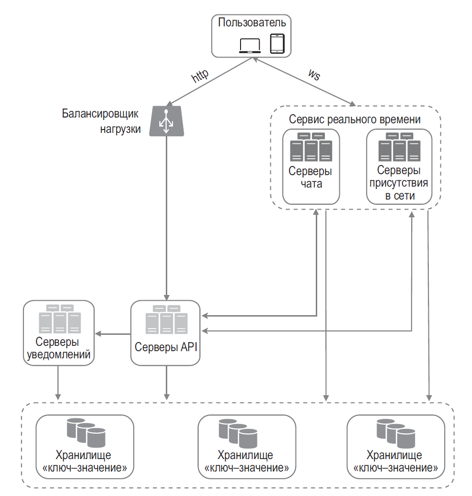

## ПРОЕКТИРОВАНИЕ СИСТЕМЫ МГНОВЕННОГО ОБМЕНА СООБЩЕНИЯМИ

С годами было выработано множество способов имитации соединения, инициированного сервером: HTTP-опрос, длинный HTTP-опрос (long polling) и WebSocket

У длинного HTTP-опроса есть несколько недостатков.
- Отправитель и получатель могут быть подключены к разным серверам чата. HTTP-серверы обычно не хранят свое состояние. Если вы балансируете нагрузку путем циклического перебора, у сервера, принявшего сообщение, **может не быть соединения** с клиентом, которому это сообщение направлено.
- У сервера нет хорошего механизма для определения того, **отключился ли клиент**.
- Это **неэффективный подход**. Если пользователь не слишком активен, время ожидания будет периодически истекать и соединение будет устанавливаться заново.

- Серверы чата отвечают отправкой/получением сообщений.
- Серверы присутствия следят за тем, находятся ли пользователи в сети.
- Серверы API занимаются всем остальным, включая вход в систему, регистрацию, редактирование профиля и т. д.
- Серверы уведомлений отправляют push-уведомления.
- И наконец, хранилище типа «ключ–значение» используется для хранения истории переписки. Когда пользователь появляется в сети, он видит все предыдущие сообщения.

