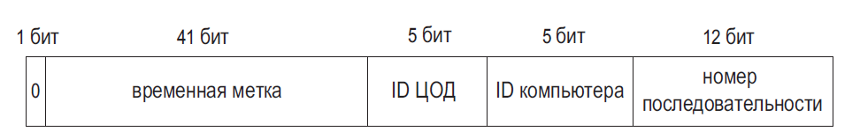
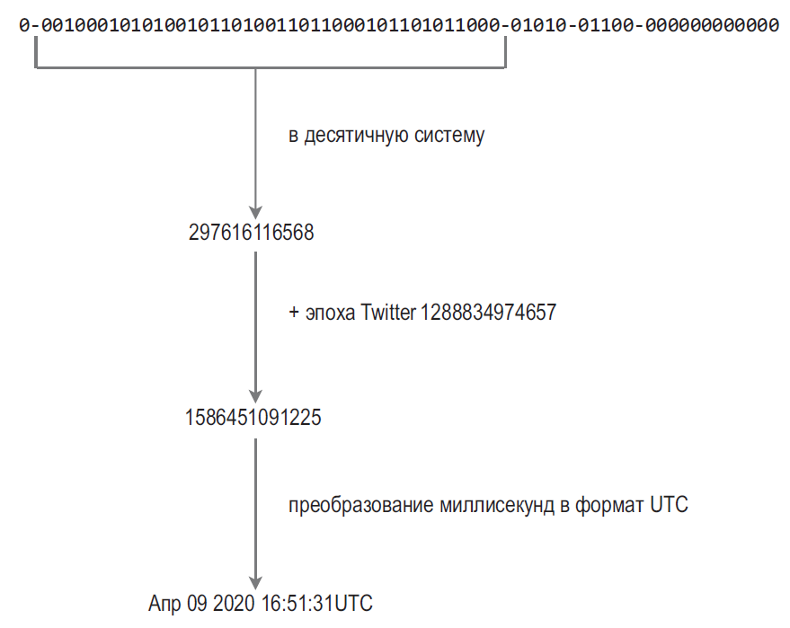

## ПРОЕКТИРОВАНИЕ ГЕНЕРАТОРА УНИКАЛЬНЫХ ИДЕНТИФИКАТОРОВ В РАСПРЕДЕЛЕННЫХ СИСТЕМАХ

- Бит знака: 1 бит. Всегда равен 0 и зарезервирован на будущее. С его помощью потенциально **можно различать знаковые и беззнаковые числа**.
- Временная метка: 41 бит. Количество миллисекунд, прошедших с начала эпохи Unix или какого-то другого момента. В Twitter snowflake начальной точкой по умолчанию является Ноя 04, 2010, 01:42:54 UTC, что эквивалентно 1288834974657. Мы воспользуемся этим значением.
- ID ЦОД: 5 бит, что дает нам 2 ^ 5 = 32 центра обработки данных.
- ID компьютера: 5 бит, что дает нам 2 ^ 5 = 32 компьютера в каждом ЦОД.
- Номер последовательности: 12 бит. При генерации каждого ID на отдельно взятом компьютере или процессе номер последовательности инкрементируется на 1. Каждую миллисекунду этот номер обнуляется.

