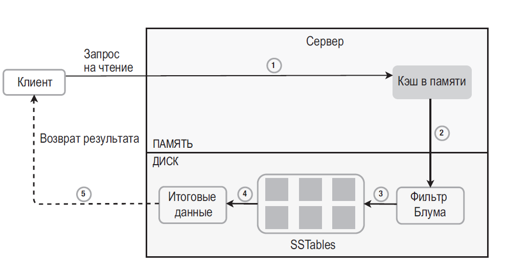

## ПРОЕКТИРОВАНИЕ ХРАНИЛИЩА ТИПА «КЛЮЧ–ЗНАЧЕНИЕ»

Когда запрос на чтение направляется к определенному узлу, система сначала проверяет, находятся ли требуемые данные в кэше. Если это так, система возвращает их клиенту

Если в памяти данных нет, они берутся с диска. Нам нужен эффективный способ поиска таблицы **SSTable**, в которой содержится ключ. Для этого часто используется **фильтр Блума** 

**SSTable (Sorted String Table)** — это формат файлов, используемый базами данных, такими как _Apache Cassandra и ScyllaDB_, для постоянного хранения данных на диске. Они создаются из memtable (структуры в памяти) при достижении порогового значения и **хранят данные в отсортированном, неизменяемом формате**, что обеспечивает эффективный поиск

**Фи́льтр Блу́ма** — вероятностная структура данных, позволяющая проверять принадлежность элемента к множеству. При этом существует возможность получить **ложноположительное** срабатывание, **но не ложноотрицательное**.

