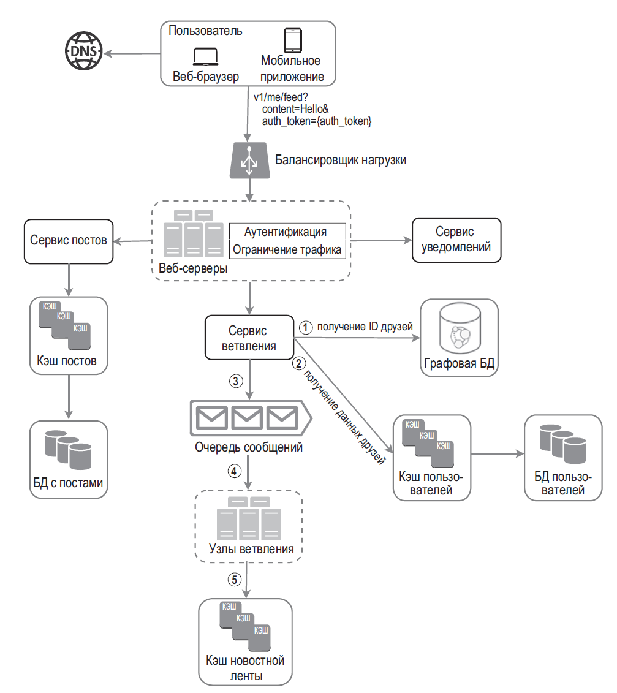
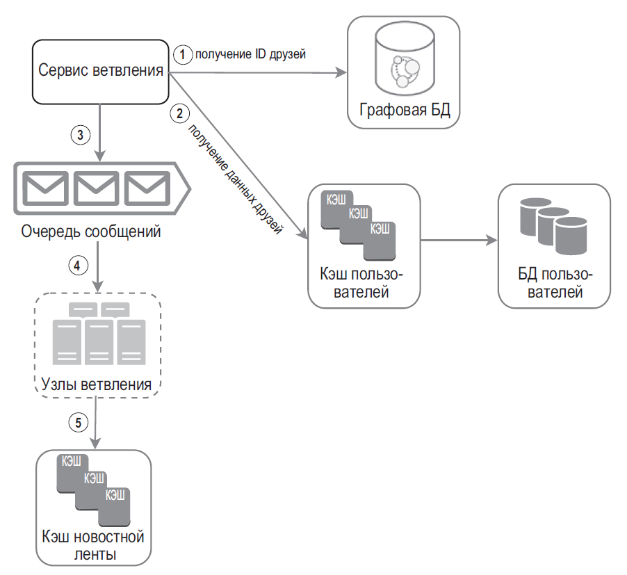
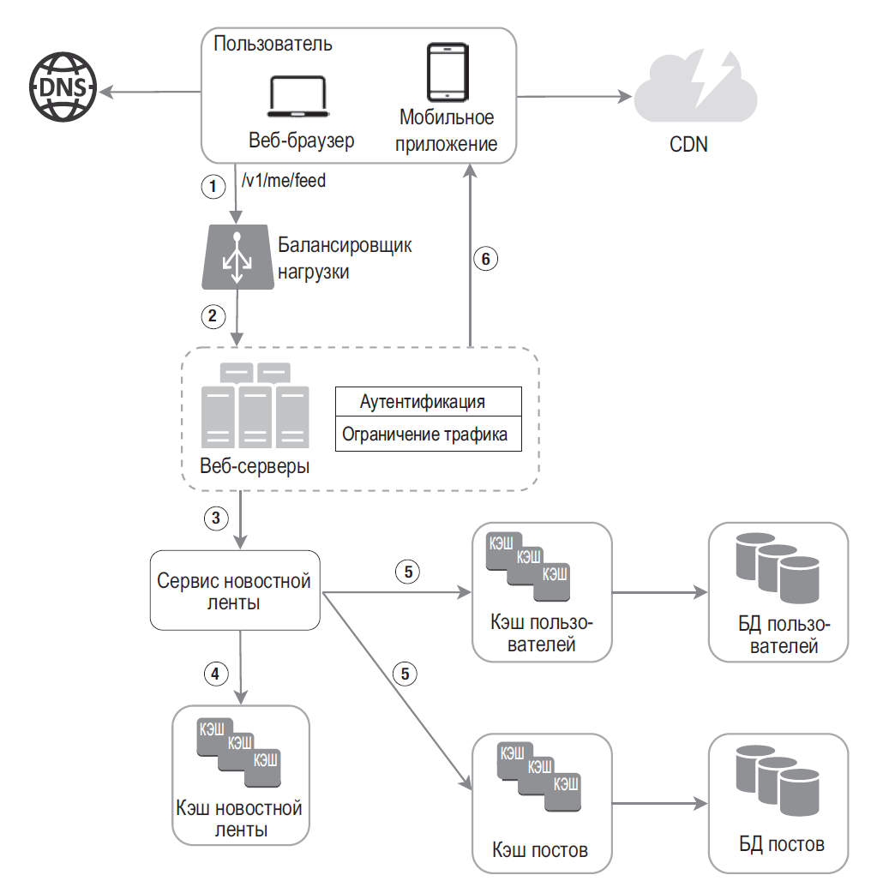
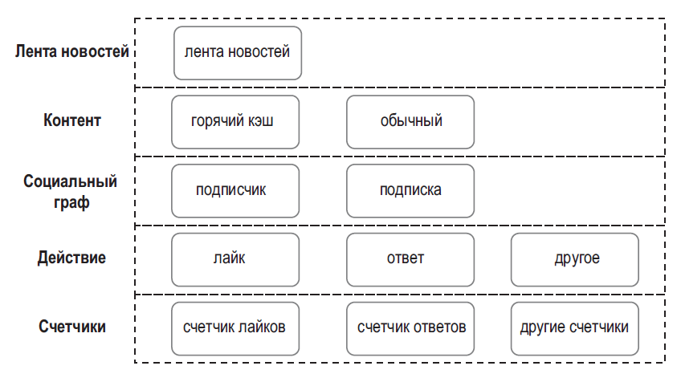

## ПРОЕКТИРОВАНИЕ ЛЕНТЫ НОВОСТЕЙ

### Сервис ветвления

Сервис ветвления работает следующим образом:
- Извлекаем идентификаторы друзей из графовой базы данных. Графовая БД подходит для управления связями между друзьями и рекомендации новых друзей. 
- Получаем информацию о друзьях из кэша пользователей. Система фильтрует полученный список с учетом пользовательских настроек. Например, если вы решили «заглушить» одного из своих друзей, его посты не попадут в вашу ленту. Пост также может быть скрыт по той причине, что пользователь решил поделиться информацией лишь с определенным кругом друзей или скрыть его от других людей.
- Отправляем список друзей и ID новой статьи в очередь сообщений.
- Узлы ветвления достают данные из очереди сообщений и сохраняют содержимое ленты новостей в кэше. Кэш ленты новостей можно представить в виде хеш-таблицы <post_id, user_id>. Новые посты добавляются в нее в момент создания. Если хранить в кэше данные о пользователях и содержимое постов, расход памяти сильно вырастет. Поэтому мы храним лишь идентификаторы. Чтобы ограничить расход памяти, мы устанавливаем лимит, который можно настраивать. Вероятность того, что пользователь будет прокручивать тысячи постов, невысока. Большинство людей интересуются самым новым контентом, поэтому доля промахов кэша остается низкой.
- Сохраняем <post_id, user_id> в кэш ленты новостей

### Получение ленты новостей

**Ветвление при записи**. В рамках этого подхода лента новостей составляется во время записи. После публикации новый пост сразу же помещается в кэш друзей.

**Ветвление при чтении**. Лента новостей генерируется во время чтения. Последние посты загружаются, когда пользователь загружает домашнюю страницу.

Мы применим **гибридный поход**, чтобы получить преимущества обеих моделей и избежать их недостатков. Нам крайне важно, чтобы ленту новостей можно было получить быстро, поэтому для большинства пользователей предусмотрена модель push. Контент знаменитостей и пользователей с большим количеством друзей/подписчиков можно запрашивать по требованию, чтобы не перегружать систему. Согласованное хеширование позволяет справляться с большим количеством друзей за счет более равномерного распределения запросов/данных.

- Балансировщик нагрузки распределяет запросы между веб-серверами.
- Веб-серверы обращаются за новостной лентой к соответствующему сервису.
- Сервис извлекает из кэша новостной ленты список с идентификаторами постов.
- Лента новостей пользователя не ограничивается списком идентификаторов. Она содержит имена пользователей, аватары, текст
- постов, изображения и т. д. Таким образом, сервис новостной ленты извлекает полные данные о пользователях и постах из соответствующих кэшей, чтобы составить полноценную автоматизированную ленту новостей.
- Полноценная лента новостей возвращается на клиент в формате JSON для дальнейшего отображения.

### Архитектура кэширования

- Лента новостей хранит идентификаторы постов.
- Контент хранит данные каждого поста. Популярный контент находится в горячем кэше.
- Социальный граф хранит данные об отношениях между пользователями.
- Действие хранит информацию о действиях пользователя по отношению к посту: лайкнул, оставил ответ или что-то другое.
- Счетчики включают счетчики лайков, ответов, подписчиков, тех, на кого пользователь подписан, и т. д.

