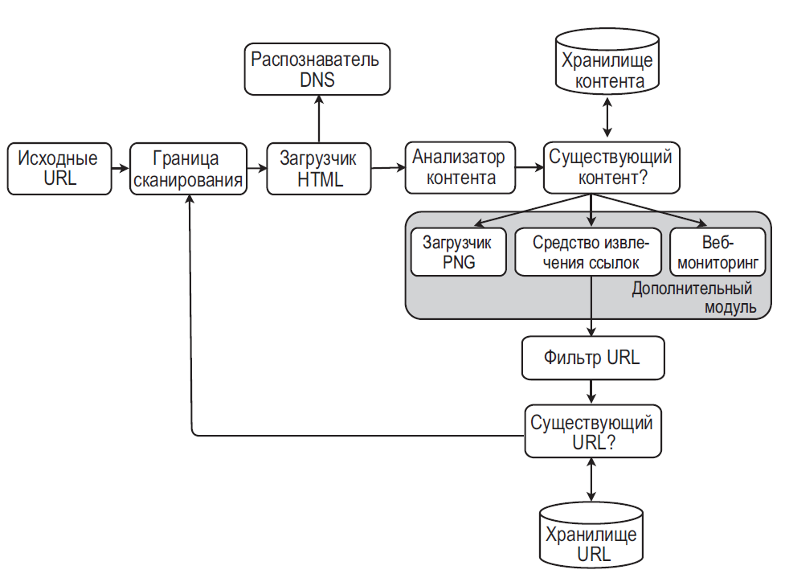

## ПРОЕКТИРОВАНИЕ ПОИСКОВОГО РОБОТА

- Шаг 1. Добавляем исходные URL-адреса в очередь FIFO.
- Шаг 2. Загрузчик HTML берет список URL-адресов из очереди FIFO.
- Шаг 3. Чтобы загрузить веб-страницу, URL сначала нужно перевести в IP-адрес
- Шаг 4. проверка на корректность HTML.
- Шаг 5. проверка на дубликат контента
- Шаг 6. Компонент «Существующий контент?» проверяет, есть ли данная HTML-страница в хранилище:
    - если есть, это означает, что этот контент находится по другому URL-адресу и мы его уже обработали. В этом случае HTML-страница отклоняется;
    - если нет, система еще не обрабатывала этот контент, поэтому он передается средству извлечения ссылок.
- Шаг 7. Из HTML-страниц извлекаются ссылки.
- Шаг 8. Фильтр URL-адресов отклоняет определенные типы контента, расширения файлов, ссылки на страницы с ошибками и URL-адреса, занесенные в черный список.
- Шаг 9. отслеживает URL-адреса, которые уже посещались или находятся в границе сканирования. Для реализации этого компонента обычно применяют такие методики, как фильтр Блума и хеш-таблица
- Шаг 10. Компонент «Существующий URL-адрес?» проверяет, находится ли URL в хранилище. Если да, то он уже обрабатывался и больше ничего делать не нужно.
- Шаг 11. Если URL-адрес еще не обрабатывался, он добавляется в границу сканирования.

- Генерация страниц на стороне сервера. Многие веб-сайты генерируют ссылки на лету, используя JavaScript, AJAX и т. д. Если мы будем загружать и разбирать веб-страницы напрямую, нам не удастся извлечь динамически сгенерированные ссылки. Чтобы решить эту проблему, перед разбором веб-страницы мы генерируем ее на сервере [12].
- Фильтрация нежелательных страниц. Поскольку емкость хранилища и ресурсы поискового робота ограничены, будет полезно использовать компонент для борьбы со спамом, который будет фильтровать низкокачественные и рекламные страницы [13] [14].
- Репликация и сегментирование базы данных. Такие методики, как репликация и сегментирование, позволяют улучшить доступность, масштабируемость и надежность уровня данных.
- Горизонтальное масштабирование. Для крупномасштабного обхода загрузкой должны заниматься сотни или даже тысячи серверов. Главное, чтобы они не хранили свое состояние.
- Доступность, согласованность и надежность. Это ключевые характеристики успеха любой крупной системы. Мы подробно обсудили их в главе 1.
- Аналитика. Сбор и анализ данных — важная часть системы и ключевой элемент ее оптимизации.