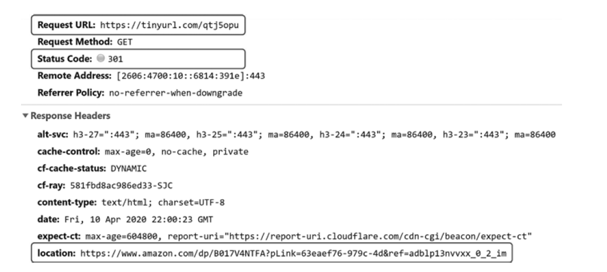
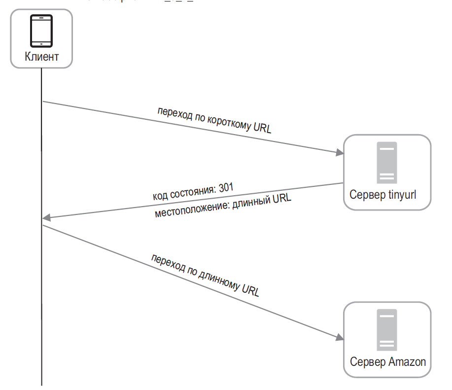
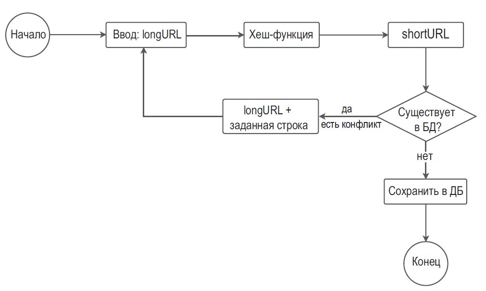
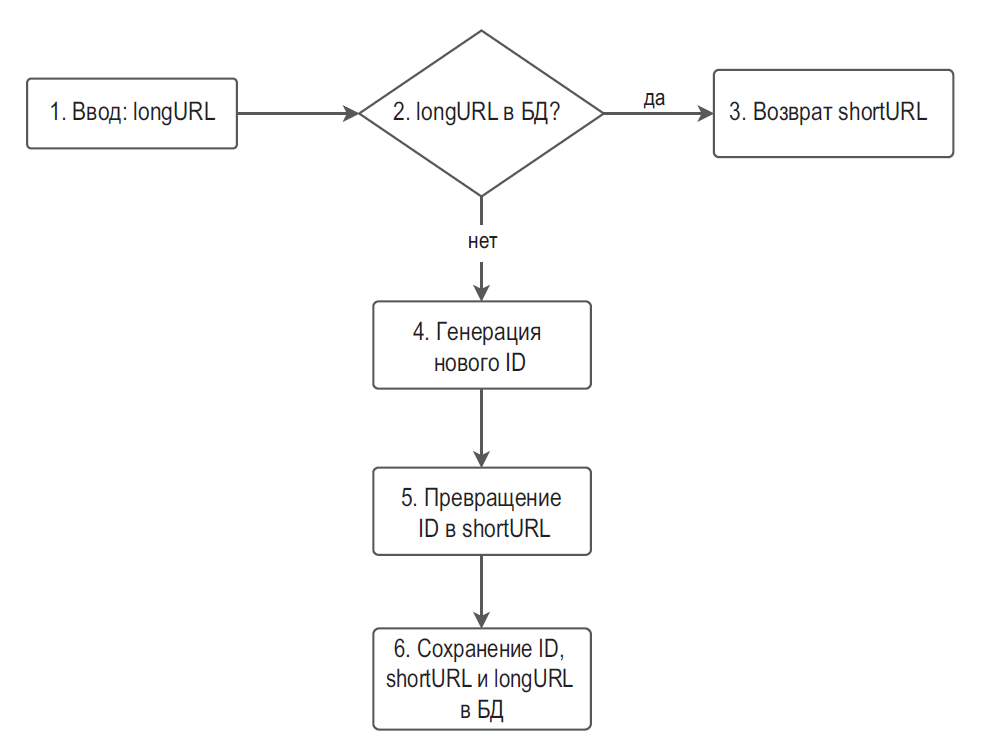
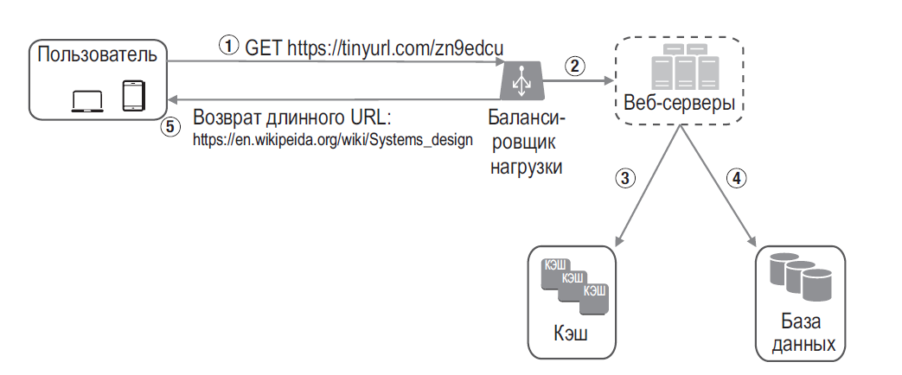

## ПРОЕКТИРОВАНИЕ СИСТЕМЫ ДЛЯ СОКРАЩЕНИЯ URL-АДРЕСОВ

- Перенаправление **301**. Код состояния 301 означает, что запрошенный URL-адрес «**навсегда**» перемещен по длинному URL-адресу. Так как перенаправление постоянное, браузер кэширует ответ и последующие запросы по тому же адресу не будут направляться к нашему сервису. Вместо этого браузер сразу откроет сокращенный URL-адрес. Если нам в первую очередь нужно **снизить нагрузку на сервер**, лучше использовать код состояния 301
- Перенаправление **302**. Код состояния 302 означает, что URL-адрес «**временно**» перемещен по длинному URL-адресу. То есть последующие запросы того же URL-адреса будут сначала отправляться нашему сервису, а затем перенаправляться к серверу длинного URL-адреса. Если же нам **нужна аналитическая информация**, стоит выбрать код состояния **302**, так как он упрощает отслеживание частоты и источника переходов по ссылке.

- Пользователь кликает по короткой ссылке https://tinyurl.com/zn9edcu.
- Балансировщик нагрузки направляет запрос к веб-серверам.
- Если shortURL уже есть в кэше, то сразу возвращается longURL.
- Если shortURL нет в кэше, то longURL извлекается из базы данных. Если этого адреса нет в БД, пользователь, скорее всего, ввел его неправильно.
- Пользователю возвращается longURL.

- Ограничитель трафика. Мы можем столкнуться с потенциальной проблемой безопасности: злоумышленники могут послать чрезмерно большое количество запросов на сокращение URL-адреса. Ограничитель трафика помогает фильтровать запросы с учетом IP-адреса или других правил. Если вам нужно вспомнить эту тему, вернитесь к главе 4 «Проектирование ограничителя трафика».
- Масштабирование веб-серверов. Поскольку веб-уровень не хранит свое состояние, его легко масштабировать, добавляя или удаляя веб-серверы.
- Масштабирование базы данных. Репликация и сегментирование базы данных являются распространенными методиками.
- Аналитика. Данные играют все более важную роль в успехе бизнеса. Интеграция аналитической системы в сервис для сокращения URL-адресов поможет получить такие ценные сведения, как количество пользователей, перешедших по ссылке, точное время перехода и т. д.
- Доступность, согласованность и надежность. Эти характеристики являются ключом к успеху любой крупной системы. Мы подробно обсуждали их в главе 1. Пожалуйста, вспомните эту тему.