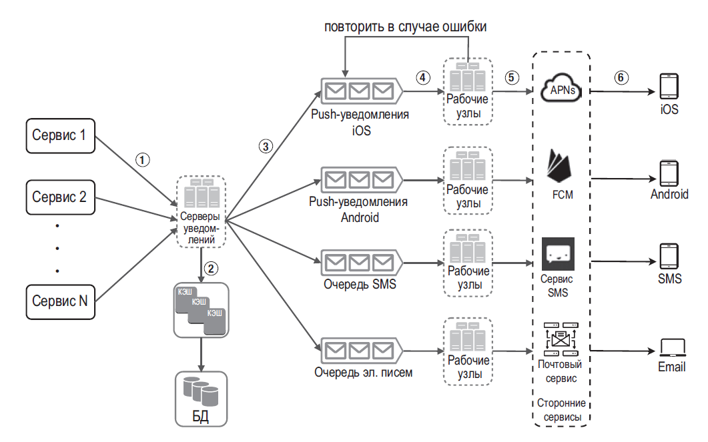
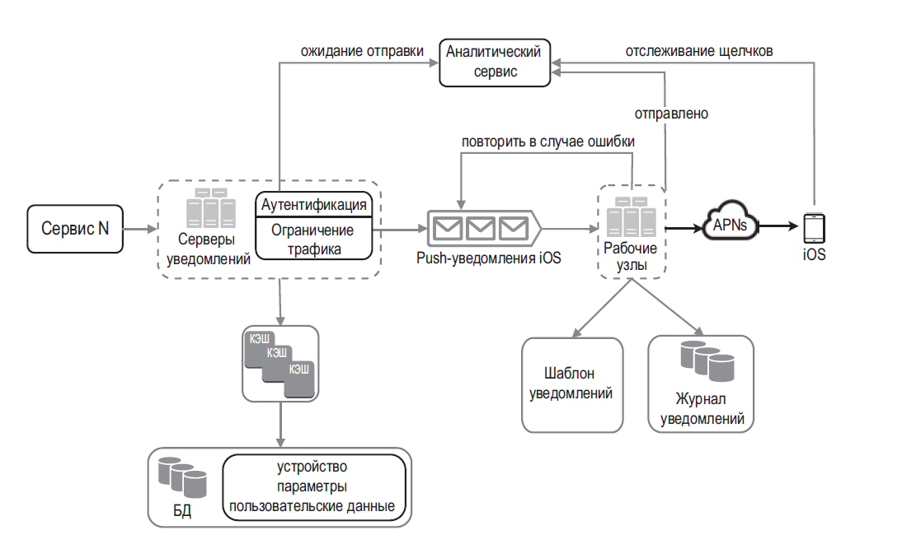

## ПРОЕКТИРОВАНИЕ СИСТЕМЫ УВЕДОМЛЕНИЙ

**Рабочие узлы** — список серверов, которые достают события об уведомлениях из очереди сообщений и отправляют их соответствующим сторонним сервисам.

Одно из важнейших требований к системе уведомлений — она не должна терять данные. Уведомления, как правило, могут задерживаться или приходить в другом порядке, но они никогда не теряются. Для удовлетворения этого требования система записывает уведомления в лог, который хранится в базе данных, и реализует механизм повторных вызовов

- Надежность. Мы предложили надежный механизм повторных вызовов для минимизации частоты сбоев.
- Безопасность. Чтобы уведомления могли отправлять только проверенные клиенты, мы использовали пару AppKey/appSecret.
- Отслеживание и мониторинг. Эти механизмы могут быть реализованы на любом этапе процесса отправки уведомлений для получения полезной статистики.
- Соблюдение пользовательских настроек. Пользователи могут отказаться от рассылки. Прежде чем отправлять уведомления, наша система проверяет пользовательские настройки.
- Ограничение трафика. Пользователи будут признательны, если уведомления не будут сыпаться на них ежеминутно.

