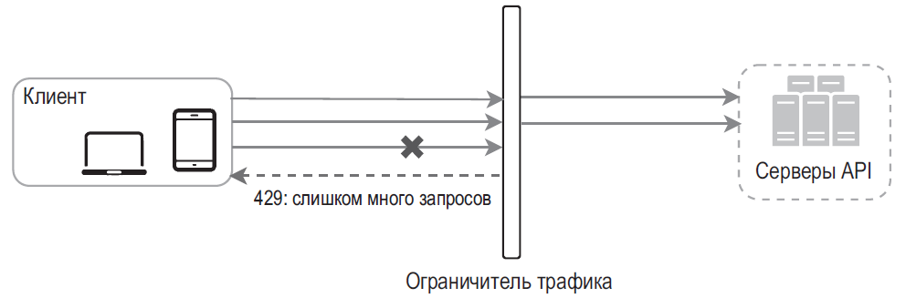
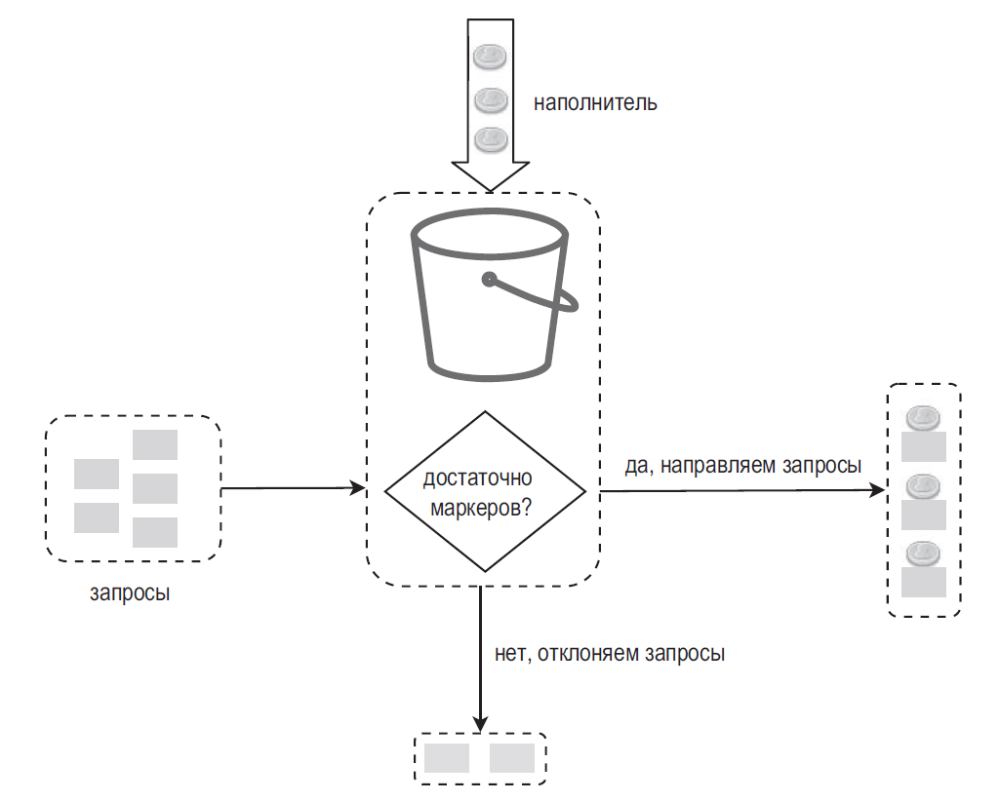
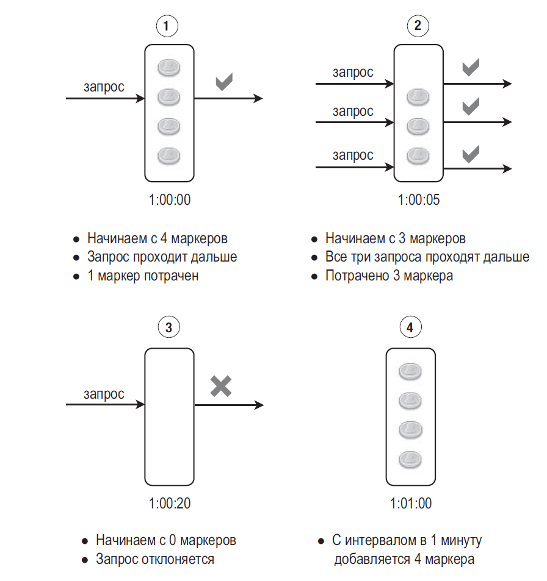
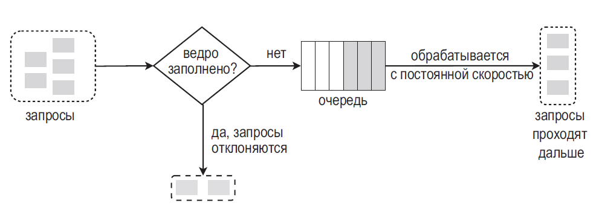
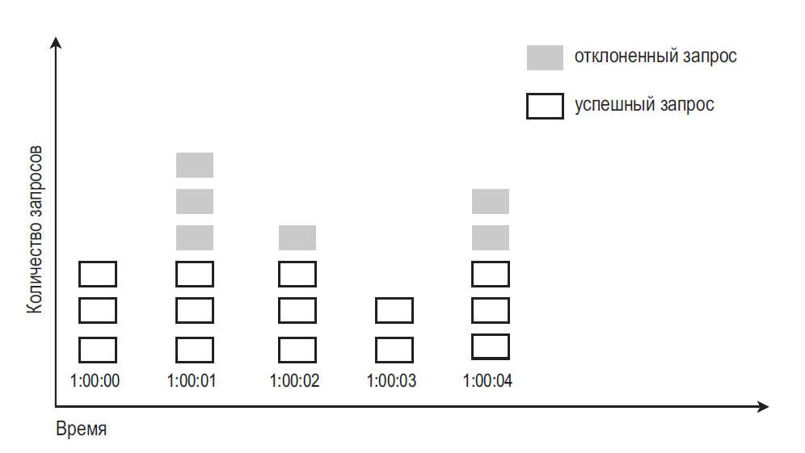
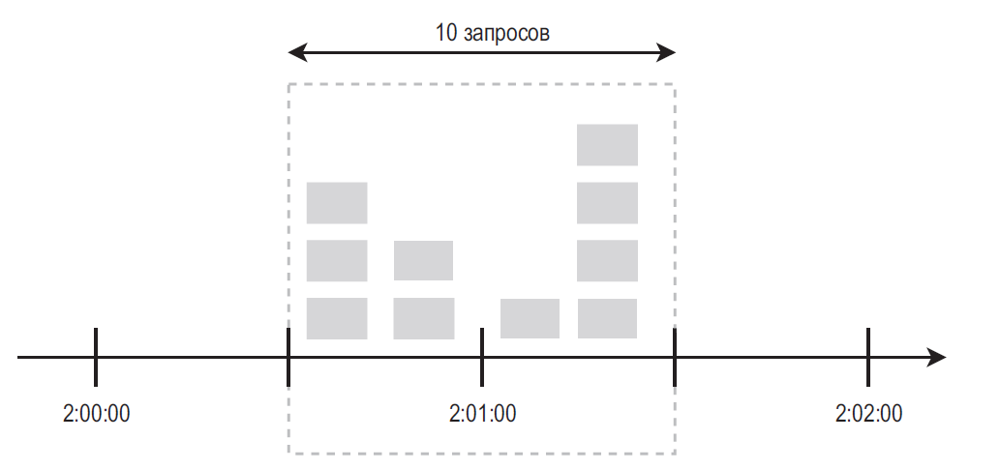
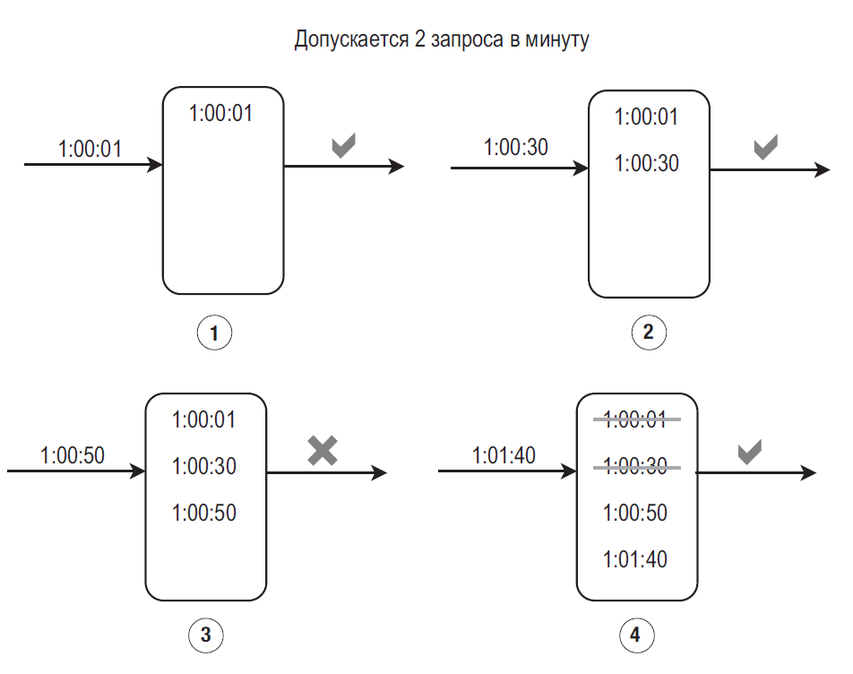
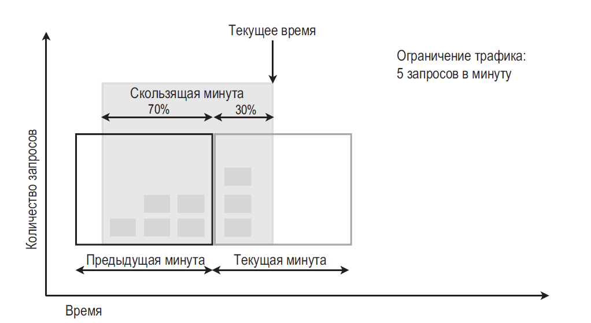
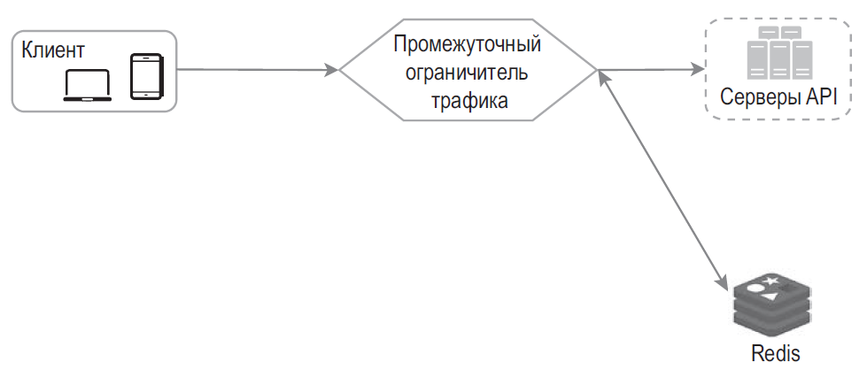
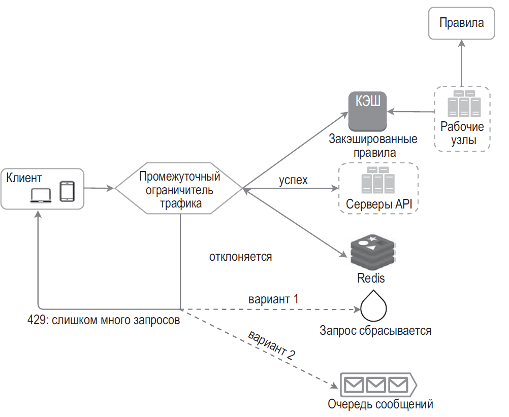

## ПРОЕКТИРОВАНИЕ ОГРАНИЧИТЕЛЯ ТРАФИКА

Ограничитель трафика используется в сетевых системах для управления скоростью передачи данных от клиента или сервиса. В мире HTTP он ограничивает количество запросов, которые пользователь может отправить за определенный промежуток времени. Если исчерпано максимальное число API-запросов, заданное ограничителем трафика, все последующие вызовы блокируются. Вот несколько примеров:
- пользователь может создать не больше двух сообщений в секунду;
- с одного IP-адреса можно создать не больше 10 учетных записей в день;
- на одном устройстве можно получить не больше 5 наград в неделю.

При проектировании ограничителя трафика необходимо задаться следующим вопросом: где он должен быть реализован — на стороне сервера или в шлюзе? Универсального ответа не существует.

- Проанализируйте ваш текущий технологический стек, включая язык программирования, сервис кэширования и т. д. Убедитесь в том, что язык, который вы используете, позволит вам эффективно реализовать ограничитель трафика на стороне сервера.
- Выберите алгоритм ограничения трафика, который соответствует вашим бизнес-требованиям. Когда все реализуется на стороне сервера, алгоритм находится под вашим полным контролем. Но если вы используете сторонний шлюз, выбор может быть ограничен.
- Если вы уже используете микросервисы и ваша архитектура предусматривает шлюз API для выполнения аутентификации, ведения белых списков IP-адресов и т. д., ограничитель трафика можно добавить в этот шлюз.
- Разработка собственного сервиса для ограничения трафика занимает время. Если ваших инженерных ресурсов для этого недостаточно, лучше выбрать коммерческий шлюз API.

### Алгоритмы ограничения трафика

- **алгоритм маркерной корзины (token bucket)**;
- **алгоритм дырявого ведра (leaking bucket)**;
- **счетчик фиксированных интервалов (fixed window counter)**;
- **журнал скользящих интервалов (sliding window log)**;
- **счетчик скользящих интервалов (sliding window counter)**.

#### алгоритм маркерной корзины (token bucket)

Алгоритм маркерной корзины принимает два параметра:
- размер корзины: максимальное количество маркеров, которое может в ней находиться;
- частота пополнения: количество маркеров, ежесекундно добавляемых в корзину.

Сколько корзин нам нужно? Это зависит от правил ограничения трафика. Вот несколько примеров.
- Для разных конечных точек API обычно нужны разные корзины. Например, если пользователь публикует 1 сообщение в секунду, добавляет 150 друзей в день и «лайкает» 5 сообщений в секунду, каждому пользователю нужно выделить 3 корзины.
- Если нам нужно фильтровать запросы в зависимости от IP-адресов, каждому IP-адресу требуется корзина.
- Если система допускает не больше 10 000 запросов в секунду, логично предусмотреть глобальную корзину для всех запросов.

#### алгоритм дырявого ведра (leaking bucket);
Алгоритмы дырявого ведра и маркерной корзины очень похожи, только первый обрабатывает запросы с фиксированной скоростью. Обычно его реализуют с использованием очереди типа FIFO

запросы обрабатываются с постоянной скоростью, поэтому этот алгоритм подходит для задач, которые требуют стабильной скорости обработки.

#### счетчик фиксированных интервалов (fixed window counter);

система допускает не больше 5 запросов в минуту, а квота ради удобства сбрасывается ежеминутно. Как видите, на интервале между 2:00:00 и 2:01:00 имеется пять запросов и еще пять — между 2:01:00 и 2:02:00. Таким образом, за одну минуту, между 2:00:30 и 2:01:30, система принимает 10 запросов — в два раза больше позволенного.

Недостатки: всплески трафика на границе временных интервалов могут привести к приему запросов, количество которых превышает квоту.

#### журнал скользящих интервалов (sliding window log);
Алгоритм следит за временными метками запросов. Временные метки обычно хранятся в кэше, например, в упорядоченных множествах Redis

- Когда в 1:00:01 приходит новый запрос, журнал пуст, поэтому запрос принимается.
- В 1:00:30 приходит новый запрос, и временная метка 1:00:30 записывается в журнал. После этого размер журнала равен 2, что не превышает допустимое значение. Запрос принимается.
- В 1:00:50 приходит новый запрос, и временная метка 1:00:50 записывается в журнал. После этого размер журнала равен 3, что превышает допустимое значение. Запрос отклоняется, хотя временная метка остается в журнале.
- В 1:01:40 приходит новый запрос. Запросы в диапазоне [1:00:40,1:01:40) находятся на текущем временном интервале, а запросы, отправленные до 1:00:40, являются устаревшими. Две просроченные временные метки, 1:00:01 и 1:00:30, удаляются из журнала. После этого размер журнала равен 2, поэтому запрос принимается.

Преимущества: ограничение трафика, реализованное с помощью этого алгоритма, получается очень точным; на любом скользящем интервале запросы не превышают заданный лимит.

Недостатки: этот алгоритм потребляет много памяти, потому что даже в случае отклонения запроса соответствующая временная метка записывается в журнал.

#### Счетчик скользящих интервалов (sliding window counter)

Преимущества:
- сглаживание всплесков трафика: текущая частота запросов зависит от той, которая использовалась на предыдущем интервале;
- экономия памяти.

### Общая архитектура
Где следует хранить счетчики? Базу данных лучше не использовать ввиду медленного доступа к диску. Одним из популярных решений для ограничения трафика является **Redis**. Это резидентное хранилище предлагает две команды: INCR и EXPIRE.
- INCR увеличивает хранимый счетчик на 1.
- EXPIRE устанавливает срок хранения счетчика, по истечении которого тот автоматически удаляется.

### Подробная архитектура

Как клиент узнает, что его трафик ограничивается? И откуда он может узнать количество запросов, которые он может выполнить, прежде чем вступят в силу ограничения? Ответ заключается в заголовках HTTP-ответов. Ограничитель трафика возвращает клиентам следующие HTTP-заголовки:
- X-Ratelimit-Remaining. Количество допустимых запросов, которое остается в текущем интервале.
- X-Ratelimit-Limit. Количество вызовов, доступных клиенту в каждом временном интервале.
- X-Ratelimit-Retry-After. Количество секунд, которое должно пройти, прежде чем ваши запросы престанут отклоняться.

Если пользователь отправит слишком много запросов, клиенту будет возвращен код ошибки 429 и заголовок X-Ratelimit-Retry-After.

Промежуточный ограничитель трафика загружает правила из кэша. Он извлекает из кэша Redis счетчики и временную метку последнего запроса. Ограничитель трафика принимает решение в зависимости от полученной информации:
- если запрос не отклоняется, он направляется к серверам API;
- если запрос отклоняется, ограничитель трафика возвращает клиенту код ошибки 429. Тем временем запрос либо сбрасывается, либо направляется в очередь.

### Ограничитель трафика в распределенном окружении

Спроектировать ограничитель трафика, который работает в рамках одного сервера, несложно. А вот масштабирование системы для поддержки множества серверов и конкурентных потоков выполнения — совсем другое дело. Существует две проблемы:
- состояние гонки;
- сложность синхронизации.

